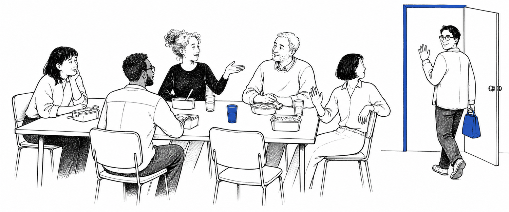

# 中文职场角色与场景矩阵

[← 返回首页](../../README.md) · [主 SOP](sop.md) · [管理者附加章](manager-style-addon.md) · [情景练习](scenarios.md)

先读[中文版主 SOP](sop.md)，再用本表查具体人、具体场合和具体人数。

面对管理者时，可以选读[管理者沟通偏好附加章](manager-style-addon.md)，调整表达方式，但不给人贴固定性格标签。

本表不是“看人下菜碟”。不要从外貌猜性别、年龄、婚姻、怀孕、是否有孩子、健康或性取向。

## 一、五步定位

选话题前按顺序判断：

1. **权力**：谁掌握评价、排班、薪资、项目、资源或机会？
2. **场所**：公开还是私下？封闭空间、线上还是下班后？
3. **性质**：纯社交、工作沟通、发展交流，还是藏着任务？
4. **人数**：一对一、两三个人、大组，还是正式饭局？
5. **已知信息**：对方在这个关系和场合里主动说过什么？

权力和场所优先于性别、年龄与家庭状态。不知道时，一律用中性默认。

## 二、角色与职能

| 角色 | 默认目标 | 适合起点 | 主要风险 |
| --- | --- | --- | --- |
| 同团队同级 | 让日后协作更顺 | 共同项目、午饭、通勤、公开兴趣 | 查户口、八卦、把同级当密友 |
| 跨部门同级 | 建立接口，不套内部消息 | 共同流程、活动、公开专长 | 借熟悉绕流程、刺探信息 |
| 新人或资历较浅的同级 | 降低陌生感 | 实用信息、姓名、周边选择 | 把对方当孩子、考文化适配 |
| 你的下属 | 让对方被看见且能退出 | 工作量、资源、低压力兴趣 | 友好问题被理解为必须回答 |
| 直属上级 | 正常连接，不刻意经营 | 共同情境、公开重点、轻兴趣 | 奉承、藏着请示、把偶遇变汇报 |
| 加一或加二 | 简短建立识别度 | 公开讲话、公司活动、共同议题 | 电梯述职、越级告状、突然求晋升 |
| 副职或副经理 | 按真实分工尊重其职责 | 团队接口、当前工作、共同现场 | 当成“正职传话筒”或比较权力 |
| 矩阵或虚线上级 | 先确认此刻是哪种职责 | 共同项目、优先级、协作方式 | 混淆两条线的指令 |
| 带教、导师或 sponsor | 维持约定的发展关系 | 学习、职业兴趣、专业经历 | 把指导自动理解为私人友谊 |

“加一”通常指直属上级的上级，“加二”再高一级。公司叫法不同，应以真实汇报线为准。

### 2.1 同团队同级

**适合**

- 围绕共同经历，一问一答一分享。
- 记住对方主动提过的轻信息。
- 私下朋友信息不带进群聊和饭局。

**可以说**

- “你那边这周节奏怎么样？”
- “附近午饭你有没有比较常去的？”
- “刚才那个会信息挺多，要聊两句还是先缓缓？”

**不要**

- 连问老家、收入、对象、房子、孩子。
- 把每个回答变成建议或比较。
- 通过一个同事打听另一个同事。

### 2.2 跨部门同级

**适合**

- 先说明共同接口。
- 真有工作诉求就直接讲。
- 夸具体专业动作，不套受限信息。

**可以说**

- “我们两边都碰到入职流程，你们用起来怎么样？”
- “刚才你讲风险那段很清楚，之前也做过类似项目吗？”
- “我后面有一个工作问题，先直接说目的。”

**不要**

- “私下说说，你们部门到底要怎么调整？”
- 靠饭局或私人关系跳过正式负责人。

### 2.3 你的下属

领导口中的“随便聊聊”也可能被听成考察。

**适合**

- 对团队使用一致的中性工作量问题。
- 邀请时给可信的“不参加也没关系”。
- 绩效、排班、反馈和任务单独说清。

**可以说**

- “这周工作量怎么样？有没有需要我一起调优先级的？”
- “我 12 点半去吃饭，想来可以一起；项目决定还是回群里同步。”
- “这是普通问候，离开的原因不用说。”

**不要**

- 问对象、婚育、疾病、住址和家庭安排。
- 用闲聊试探晚上或周末能不能加班。
- 用聚餐、喝酒、群活跃或话多评价融入。

### 2.4 直属上级

先遵守以下权力边界，再用可选的[管理者沟通偏好附加章](manager-style-addon.md)测试具体任务的表达偏好，不给领导贴固定类型。

**适合**

- 对方赶时间时保持短。
- 有具体感谢就说具体影响。
- 有工作请求尽早点明，不绕半天。

**可以说**

- “王经理，早。上午会挺多？”
- “刚才您把两个方案拆开后，我知道怎么补材料了。”
- “我有一个工作问题，您方便时占五分钟。”

**不要**

- 每句话都附和。
- 在人前表演自己和领导很熟。
- 在电梯、取餐或排队时讲复杂问题。

### 2.5 加一、加二或高层

**适合**

- 默认只聊十几秒。
- 只引用公开信息。
- 复杂想法转到预约、邮件或正式渠道。

**可以说**

- “您好，刚才全员会里的客户例子很有帮助。”
- “我有个相关想法，这里不方便展开，可以发一段简短说明吗？”
- “您先忙，祝上午顺利。”

**不要**

- 临时做晋升推销。
- 越过直属上级讲单方面投诉。
- 要求高层在不了解背景时当场拍板。

### 2.6 副职、副经理和矩阵上级

副经理、副主任、VP、assistant manager 与中文“副职”并不完全对应。先确认职责，不只看头衔翻译。

**适合**

- 在其分工范围内直接尊重其决定权。
- 两条线冲突时问清谁负责最终优先级。
- 不把休息时间变成传话时间。

**可以说**

- “这个项目的最终优先级，我跟您对齐还是跟陈经理对齐？”
- “最近两个团队交接得还顺吗？”
- “工作细节我单独发，先不占这个休息时间。”

**不要**

- “您帮我转给真正拍板的人。”
- 闲聊两位领导谁更有权、谁更受欢迎。

## 三、性别：不按男女分话题，按风险分场景

女性、男性、非二元性别、跨性别，以及你不知道性别的人，默认话题边界相同。

| 已知情形 | 可以调整什么 | 不能改变什么 |
| --- | --- | --- |
| 不知道身份 | 用姓名或中性表达 | 不从声音、身体、衣服或伴侣猜 |
| 对方主动说明称谓或代词 | 准确使用 | 不要求解释身份经历 |
| 对方提到伴侣 | 沿用“伴侣、妻子、丈夫”等原词 | 不推断性取向和关系角色 |
| 对方公布怀孕 | 简短祝贺，跟随本人 | 不问身体、医疗和生育过程 |
| 不同性别的一对一指导 | 使用同样的职业机会规则 | 不因性别取消指导或发展机会 |
| 私密或封闭场所 | 增加透明度、距离和退出路径 | 同性别也不自动安全 |
| 私人邀请 | 最多一次，未接受就结束 | 友好不等于暧昧或同意 |

### 3.1 怎么夸人

优先夸行动、判断、专业和影响：

- “你刚才把决定讲得很清楚。”
- “你那几个问题让大家慢下来想了一遍。”
- “这次交接写得很完整。”

不要用外貌、身体、年龄、衣服合不合身、是否有女人味或男人味，作为日常职场热情。

### 3.2 机会平等与边界透明

- 指导、出差、曝光和非正式信息应跨性别公平提供。
- 权力或隐私风险高时，用公开地点、明确议程和透明渠道。
- 不要用“避嫌”把某一性别排除在职业机会之外。
- 关系、汇报线、差旅和利益冲突以公司制度为准。

## 四、年龄与生活阶段

年龄段不是话题脚本。只使用对方主动披露的信息，而且不超过其展开深度。

| 已知情况 | 可以轻接 | 不要 |
| --- | --- | --- |
| 已知是应届或职业早期 | “刚转到职场还适应吗？” | “小朋友”、恋爱盘问、代际玩笑 |
| 对方年长或经验更多 | 当前专长、兴趣和做法 | 默认健康差、快退休、有孙辈、不懂技术 |
| 对方提到伴侣 | 跟随那次活动 | 问结婚时间、家庭分工、关系好坏 |
| 对方提到孩子 | 对方愿意时轻追一个细节 | 二胎、学费、成绩、生育和育儿评价 |
| 对方提到照护家人 | 表示理解；有职责时问工作支持 | 诊断、家庭矛盾、为何别人不照护 |
| 对方说一个人住 | 跟随原话题 | 默认孤独、单身、不安全或经济困难 |
| 对方公布怀孕或育儿假 | 祝贺并跟随本人 | 猜日期、评论身体、问医疗细节 |
| 对方主动说退休计划 | 问期待的安排 | “太早/太晚”、接班传闻 |
| 什么都不知道 | 共同情境、宽泛周末 | “结婚了吗”“有孩子吗”“多大了” |

### 4.1 对方主动提到孩子

同事说：“我儿子这周刚上小学。”

相称的回应：

> “这周对你们家挺重要的。他还适应吗？”

这不代表可以继续问学费、成绩、户口、二胎、夫妻分工或教育理念。

不知道家庭情况时说：

> “周末有安排吗？”

不要说：

> “周末带孩子去哪儿？”

### 4.2 年龄相近不等于自动熟

同龄、同校年代或都在某个生活阶段，可能让话题更顺，但不取消职场、隐私、性别和暧昧边界。

## 五、时间点与场合

| 时间点 | 安全开场 | 注意信号 | 自然收尾 |
| --- | --- | --- | --- |
| 周一或周末后 | “周末休息得怎么样？” | 宽泛回答就保持宽泛 | “祝这周开局顺利。” |
| 法定假期后 | “假期有休息到吗？” | 家庭、返乡和花费可能敏感 | “回来慢慢进入状态。” |
| 旅游休假回来 | “欢迎回来，有没有愿意分享的亮点？” | 不默认花钱、开心或出远门 | “你先安顿，回头见。” |
| 原因不明的离岗后 | “欢迎回来，要快速同步还是先理一下？” | 不称作度假 | “需要时找我。” |
| 买咖啡排队 | “这家你常点什么？” | 取到咖啡就自然结束 | “好，享受咖啡。” |
| 午饭前 | “中午想好吃什么了吗？” | 饮食可能涉及健康和宗教 | “好，午饭见。” |
| 午饭后 | “刚才那家味道怎么样？” | 不评论饭量和身体 | “下午会见。” |
| 茶水间休息 | “今天节奏怎么样？” | 转回手机或工位就停 | “你继续休息，我先走了。” |
| 会前 | “大家上午怎么样？” | 照顾整个可见群体 | 主持人开始就停 |
| 困难会议后 | “刚才信息挺多，想聊两句还是先缓缓？” | 不强迫处理情绪 | “那我先给你留点空间。” |
| 汇报成功后 | “你那个例子把重点讲清了。” | 夸具体，不夸外貌 | “恭喜，回头见。” |
| 截止日前 | “打个招呼，我知道你在专注。” | 默认极短 | “加油，我不打扰了。” |
| 交班后 | “刚交完班？今天还顺吗？” | 累了就不追问 | “先休息，晚点见。” |
| 远程周一 | “早，不急回，这周开局怎么样？” | 一个表情也可结束 | “晚点聊。” |

### 5.1 刚回来不一定是开心休假

旅游、产育假、丧亲、疾病、照护、停职和原因不明的离岗，不能用同一套假设。

不知道原因时说：

> “欢迎回来。你想先快速同步，还是自己理一下再说？”

## 六、聚餐人数与性质

先判断这顿饭是什么：

- **社交午饭**：自愿的关系时间。
- **Lunch meeting**：边吃边工作的正式会议。
- **发展交流**：事先说明的职业或指导谈话。
- **客户餐**：受商务招待和合规规则约束。
- **团队晚餐**：仍是工作相关社交场景。

| 形式 | 适合话题 | 组织方式 | 主要风险 |
| --- | --- | --- | --- |
| 和同级一对一 | 共同兴趣、职业经历、当前情境 | 提问与分享平衡 | 被误解为约会、过度披露、八卦 |
| 两三个同事 | 人人能进的话题 | 轮换注意力，解释内部背景 | 两人聊成封闭小圈 |
| 多人社交午饭 | 食物、公开活动、轻经历 | 自愿加入和离开 | 轮流交隐私、只围领导 |
| 和直属上级一对一 | 事先说明休闲还是发展 | 明确是否要带工作材料 | 突然反馈、私人压力 |
| 和下属一对一 | 资源和自愿兴趣 | 领导说明退出、费用和性质 | 下属感觉必须参加 |
| 越级午饭 | 公司体验、公开重点 | 说明目的，不破坏汇报线 | 套取投诉、忠诚测试 |
| Lunch meeting | 议程 + 简短暖场 | 决策回正式渠道 | 把必到会议伪装成社交 |
| 客户或供应商餐 | 公开兴趣、活动和行程 | 明确费用、合规和目的 | 劝酒、内部比较、秘密 |
| 有酒精的团队晚餐 | 共同话题和自愿故事 | 无酒精选项同等，方便早退 | 强迫、起哄、机会只在夜间 |

### 6.1 和同级单独吃饭

**开场**

> “难得一起吃饭。这周除了眼前这个截止日，其他还顺吗？”

**保持安全**

- 自己分享多少，再问多少。
- 不默认这顿饭有暧昧含义。
- 不讨论缺席同事的私人生活。

**收尾**

> “今天聊得挺好，我得回去赶两点的会了。”

### 6.2 和直属上级单独吃饭

吃饭前确认性质：

> “这次主要是随便吃个饭，还是我需要准备点工作内容？”

突然出现正式反馈时：

> “这个我想认真听。我们能不能放到一对一里完整聊？”

上级不应借轻松午饭问恋爱、婚育、疾病、忠诚或下班后的可用性。

### 6.3 和下属单独吃饭

领导可以先说：

> “这是自愿的普通午饭，不是绩效谈话。不方便的话，我们照常开一对一就行。”

谁付费要看公司制度和团队文化。提前讲清费用，避免邀请变成人情债。

### 6.4 两三个同事一起吃饭

选每个人都能进入的话题。两个人有共同历史时，给第三个人背景，不要求他马上贡献故事。

> “我们刚才在聊新开的咖啡店。你们有人去过吗？”

不要连续十分钟说“还记得我们当年……”让一个人一直在故事外面。

### 6.5 多人午饭与 lunch meeting

社交午饭：

- 自愿参加。
- 随时离开，不需要解释。
- 重要决定回到正式工作渠道。

Lunch meeting：

- 明确叫会议。
- 提前发议程。
- 提供餐食和无障碍信息。
- 按制度计入工作时间。

不要把必须参加的工作叫“随便吃个饭”，借此取消正常会议规则。

### 6.6 和加一、加二或高层吃饭

如果是集体午餐，不要只盯着最高层说话。可以从公开业务、活动内容或行业兴趣开始。

若高层问团队体验，讲自己知道的事实：

> “我这边最明显的变化是交接时间缩短了。其他团队的情况我不替他们判断。”

不要借饭局越级评价直属上级，也不要把高层的友好理解为私下承诺。

### 6.7 副职、矩阵经理与多位领导同桌

不参与权力比较，不猜“谁说了算”。遇到工作分歧，饭后回正式渠道确认。

> “这个优先级我会后拉一个小群，把两条线的要求对齐。”

不要用“某总其实更支持你”制造派系和人情压力。

## 七、快速组合

| 组合 | 更好的动作 |
| --- | --- |
| 同级 + 买咖啡 | 共同观察，一个问题，取到咖啡就结束 |
| 同级 + 周一 | 宽泛问周末，只跟随主动细节 |
| 下属 + 离岗返岗 | 欢迎、给工作同步选项、不问原因 |
| 上级 + 一对一午饭 | 先确认性质，突然反馈转正式一对一 |
| 加二 + 电梯 | 一句公开情境 + 主动结束 |
| 副职 + 茶水间 | 尊重真实分工，不在休息时传复杂任务 |
| 三位同级 + 午饭 | 轮换注意力，防止两人形成内圈 |
| 多人午饭 + 新人 | 给背景和入口，不把新人推到聚光灯下 |
| 不同性别 + 出差晚餐 | 同一边界；行程透明、容易退出、不猜暧昧 |
| 年长同事 + 技术话题 | 问当前做法，不预设不会使用 |
| 年轻同事 + 团队活动 | 正常邀请，不把夜生活分配给“年轻人” |
| 同事提到孩子 | 只跟一个主动细节，不扩展到生育和教育评价 |

## 八、中性默认

不知道角色偏好、身份或生活阶段时：

1. 使用姓名和共同情境。
2. 只问一个可用一句话回答的问题。
3. 对不同性别和年龄保持相同尊重。
4. 把主动披露当作狭窄、当次的开放。
5. 权力、私密空间、酒精、出差和一对一会放大风险。
6. 在对方必须拒绝之前结束。

管理者风格必须排在以上规则之后。只调整表达格式，不改变事实、伦理、同意、隐私、工作机会和必要异议。
